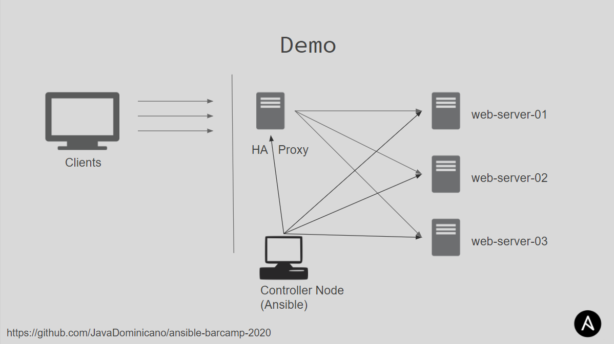

WebServer Desployment
==

Ansible lab-01

Installing:

- HAProxy
- Nginx

Using ansible:
- Templates
- Variables
- Roles
- Handlers

> demo 03 diagram

> Note: 

Infraestruture directory contains  OpenTofu (Terraform) to create infra in Digital Ocean.

If you want to test usinhg Digital Ocean and you don't have an account, use [this link](https://m.do.co/c/ba314c454a05) to get registered and get a $200 in your credit for 60 days.

[Ir atras](../README.md)
